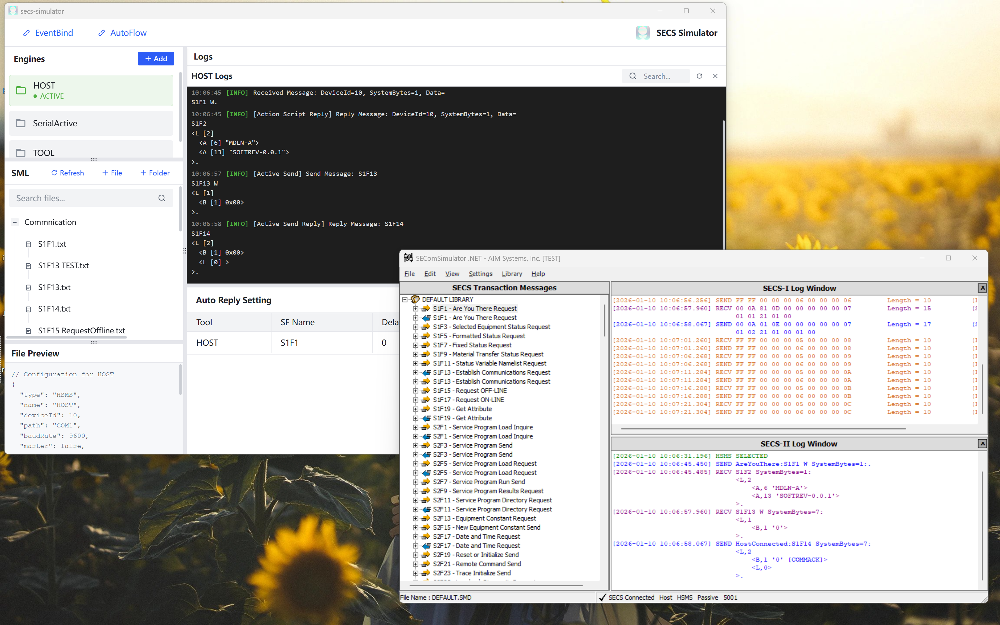
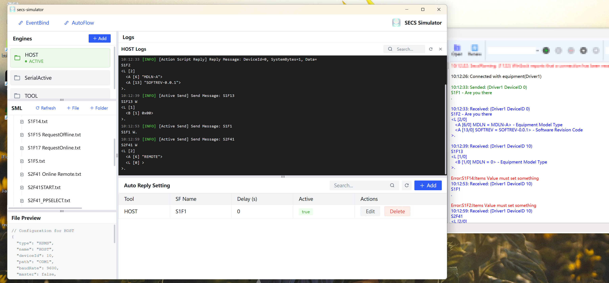

<div align=center>
<center><h1>secs-simulator<h1></center>
<div align=center>

</div>
<center><h3>特别感谢<h3></center>
</div>
<br>

<div align=center>

</div>

<div align=center>
<h3><strong>一个入门简单、跨平台、企业级桌面软件开发框架</strong></h3>
</div>
<br>

# 1. 简介

`secs-simulator` 是一款界面美观，使用简单，且在 auto-reply 自动回复上拥有极高灵活性的 SECS/GEM 测试与设备模拟工具。

基于 `electron-egg` 开发，`arco-design-vue` 作为 UI 组件库，`secs4js` 作为 SECS/GEM 通信库。

核心依赖：

- [`electron-egg`](https://github.com/dromara/electron-egg)：基于 `electron` 开发的桌面应用框架。
- [`arco-design-vue`](https://github.com/arco-design/arco-design-vue)：字节跳动出品的 Vue 组件库，提供了丰富的 UI 组件。
- [`secs4js`](https://github.com/LostCat-Qian/secs4js)：基于 TypeScript 的 SECS/GEM 通信库，用于实现 SECS/GEM 协议的通信。

<div align=center>

</div>

## 1.1 与现有 SECS/GEM Simulator 的通信表现

`SEComSimulator`:
<div align=center>

</div>

`FASTSim`:
<div align=center>

</div>

# 2. 核心功能

## 2.1 Engines

您可以通过 `Engines` 模块来创建和管理 SECS/GEM 引擎。每个引擎都可以配置为与不同的设备进行通信。

主要支持的功能：

- 支持创建多个 SECS/GEM 引擎实例。
- 每个引擎实例可以配置为与不同的设备进行通信。
- 支持配置引擎的连接参数，如 IP 地址、端口号等。
- 支持启动和停止引擎的通信。

## 2.2 SML File

您可以通过 `SML File` 模块来加载和解析 SECS/GEM 协议的 SML 文件。SML 文件是一种用于描述 SECS/GEM 协议的文本文件，通常用于定义设备的功能和通信参数。

主要支持的功能：

- 支持查看和编辑 SML 文件的内容。
- 支持根据 SML 文件生成对应的 SECS/GEM 协议代码。

## 2.3 LogPanel

您可以通过 `LogPanel` 模块来查看 SECS/GEM 引擎的通信日志。日志面板显示了引擎与设备之间的通信详情，包括发送的消息、接收的消息等。

主要支持的功能：

- 支持查看 SECS/GEM 引擎的通信日志。
- 自动保存日志到根目录下的 `secs-logs` 文件夹中。

## 2.4 AutoReply

您可以通过 `AutoReply` 模块来配置 SECS/GEM 引擎的自动回复。自动回复功能可以根据设备发送的消息，自动回复预定义的消息。

主要支持三种自动回复机制（按照优先级排序）：

1. 优先基于 AutoReply Scripts 的回复
2. 其次基于 SML File 中的回复规则，将自动查找文件名为 `S{stream}F{func + 1}` 的文件名，解析 SML 后自动回复。
3. 如果两种情况均未找到可触发回复的机制，则使用默认回复（S stream F func+1）

## 2.5 AutoReply Scripts

您可以通过 `AutoReply Scripts` 模块来配置 SECS/GEM 引擎的自动回复脚本。自动回复脚本是一种基于 JavaScript 的脚本，用于根据设备发送的消息，自动回复预定义的消息。

主要支持的功能：

- 支持查看和编辑 AutoReply Scripts 的内容。
- 支持根据 AutoReply Scripts 从 SML 文件解析对应的 SECS/GEM SML 代码。

# 3. How to Use

## 3.1 启动应用

您将看到应用主界面：

<div align=center>

</div>

## 3.2 配置 Engine

支持三种通信模式：

- HSMS-SS
- SECS-I
- SECS-I On TCP/IP

<div align=center>

</div>

## 3.3 打开 Engine

配置完成后，点击 `Open` 按钮，即可打开该引擎。

<div align=center>

</div>

## 3.4 发送消息

配置完成后，点击 `Send` 按钮，即可发送消息到设备。

<div align=center>

</div>

## 3.5 配置 AutoReply Scripts

AutoReply Scripts 是基于 JavaScript 编写的脚本，用于根据设备发送的消息，自动回复预定义的消息。

<div align=center>

</div>

默认方法名为 `handler(commingMsg, filePaths)`，参数含义如下：

1. `commingMsg`：表示设备发送到该引擎的消息，是一个 `SecsMessage` 对象。
2. `filePaths`：表示所有的本地 SML 文件的相对路径。

此外，工具本身提供了一个方法 `getMsgByFilePath(filePath: string)`，用于根据 SML 文件路径获取对应的 SECS/GEM 消息对象。该方法返回一个从 SML 文本中解析出的 `SecsMessage` 对象，您可以根据需要对其进行操作。

example:

```javascript
/**
 * Auto reply handler
 * use getMsgByFilePath(filePath) to get sml message object
 * @param {object} commingMsg args: stream, func, wBit, body(example: body[0][1].value)
 * @param {number} commingMsg.stream
 * @param {number} commingMsg.func
 * @param {boolean} commingMsg.wBit
 * @param {object} commingMsg.body
 * @param {string[]} filePaths args: sml files directory paths
 * @returns {string} sml file path
 */
async function handler(commingMsg, filePaths) {
  let targetPath = filePaths.find((f) => f.includes('S1F2_Other'))
  const msg = await getMsgByFilePath(targetPath)
  const value = msg.body[0].value
  if (value === 'MDLN-A') {
    return targetPath
  }
}
```

上面这段脚本的含义就是：从所有的 SML 文件中，查找文件名包含 `S1F2_Other` 的文件。如果该文件存在，且其 SML body 中的第一个元素值为 `MDLN-A`，则返回该文件的路径。否则，默认返回 `undefined`。

如果触发了这条规则，您就可以在对应的 LogPanel 中看到类似如下的日志：

```
23:33:16[INFO]Received Message: DeviceId=10, SystemBytes=1, Data=
S1F1 W.
23:33:16[INFO][Action Script Reply] Reply Message: DeviceId=10, SystemBytes=1, Data=
S1F2
<L [2]
  <A [6] "MDLN-A">
  <A [13] "SOFTREV-0.0.1">
>.
```

## 3.6 配置 Event Bind

EventBind 用于根据一份 TOML 配置，一键生成 GEM 事件绑定相关的 6 份 SML 指令文件，便于在设备侧快速完成 DefineReport / DefineLink 的常见配置流程。

### 3.6.1 使用步骤

1. 在主界面顶部工具栏点击 `EventBind` 打开配置窗口。
2. 在左侧编辑器中填写/修改 TOML 配置。
3. 点击 `Convert` 生成预览（右侧可切换查看 6 个指令的 SML 内容）。
4. 点击 `Save` 保存到本地目录：`sml/EventBind/EventBind_YYMMDDHHmm/`。
5. 回到左侧 `SML File` 文件树中找到生成目录，按顺序将文件发送到设备（建议顺序见下文）。

### 3.6.2 TOML 配置说明

- `[CEID_RPTID_BINDING]`：定义某个 CEID（Collection Event）绑定哪些 RPTID（Report）。
- `[RPTID_CEID_BINDING]`：定义某个 RPTID（Report）包含哪些 CEID（用于生成 DefineReport 内容）。

两段配置可以只写其中一段，但建议两段保持一致（这样 6 份文件会更完整）。

<div align=center>

</div>

### 3.6.3 生成文件说明（共 6 份）

- `01_S2F37_DisableAllEvents.txt`：S2F37，Disable All Events。
- `02_S2F35_DisableLink.txt`：S2F35，Disable Link（基于 `CEID_RPTID_BINDING` 的 CEID 列表生成）。
- `03_S2F33_DisableReport.txt`：S2F33，Disable Report（基于 `RPTID_CEID_BINDING` 的 RPTID 列表生成）。
- `04_S2F33_DefineReport.txt`：S2F33，Define Report（基于 `RPTID_CEID_BINDING` 生成每个 RPTID 的 CEID 列表）。
- `05_S2F35_EnableLinkEvent.txt`：S2F35，Enable Link Event（基于 `CEID_RPTID_BINDING` 生成 CEID -> RPTID 绑定关系）。
- `06_S2F37_EnableAllEvents.txt`：S2F37，Enable All Events。

### 3.6.4 建议下发顺序

通常建议按文件名顺序依次发送（01 → 06），用于先清空再重新定义。

### 3.6.5 常见问题

- `Convert` 按钮不可用：请检查 TOML 是否为空、是否存在语法错误，或缺少必要的段落名（`CEID_RPTID_BINDING` / `RPTID_CEID_BINDING`）。
- 生成的某些文件为空内容：通常是某个段落未填写（例如只填了 `CEID_RPTID_BINDING`，则与 Report 相关的文件可能只有空列表）。
- 找不到保存目录：开发环境保存到项目根目录下的 `sml/EventBind/`；打包后保存到 exe 同级目录下的 `sml/EventBind/`。

example:

```toml
# DefineLink Configuration Template
# Format: CEID_RPTID_BINDING section maps Collection Event IDs to Report IDs
# Format: RPTID_CEID_BINDING section shows which CEIDs use each RPTID (for reference)

# value is an array of Report IDs
[CEID_RPTID_BINDING]
# CEID = RPTID
1001 = [2001, 2002]
1002 = [2002, 3001]
1003 = [2001]

# value is an array of Collection Event IDs
[RPTID_CEID_BINDING]
# RPTID = CEID (optional - shows reference mapping)
2001 = [2004]
2002 = [2005]
3001 = [2001]
```

## 3.7 AutoFlow（自动流程）

AutoFlow 用于把一组“发送/等待/延时/记录”等动作串成流程，一键运行并在运行面板中实时查看进度与日志，适合 EAP/GEM 交互流程的自动化回归。

### 3.7.1 前置条件

- 仅支持对 `simulate=Equipment` 的引擎运行（Host 引擎不可选）。
- 运行前需先打开对应的 Equipment 引擎（引擎状态为 RUNNING）。
- `send` 步骤依赖 `SML File` 中已有的 SML 文件（`filePath` 使用文件树中的相对路径）。

### 3.7.2 快速开始

1. 在主界面顶部工具栏点击 `AutoFlow`。
2. 点击 `New` 创建流程，选择 `Select Engine`（Equipment 引擎）并填写 `Flow Name`。
3. 在 `Steps` 区域使用 `+ Send / + Wait / + Delay / + Log / + End` 添加步骤。
4. 点击 `Save` 保存流程。
5. 点击 `Run` 启动执行；执行中可 `Pause / Resume / Stop`。

### 3.7.3 配置文件与保存位置

- 每个流程会保存为一个 JSON 文件：`autoflows/<FlowName>.json`。
- 开发环境保存到项目根目录下的 `autoflows/`；打包后保存到 exe 同级目录下的 `autoflows/`。

### 3.7.4 Step 类型说明

- `send`：发送一条 SML 文件。
  - 必填：`filePath`（SML 相对路径）。
  - 可选：`timeoutMs`（等待超时，默认 30000）。
  - 可选：`waitReply`（是否使用引擎的“等待回复”发送模式）。
  - 可选：`expect`（发送后等待对端发来满足条件的消息）。
- `wait`：不发送消息，仅等待对端发来满足 `expect` 的消息。
  - 必填：`expect`。
  - 可选：`timeoutMs`（默认 30000）。
- `delay`：延时等待。
  - 必填：`ms`（毫秒，允许为 0）。
- `log`：写一条 AutoFlow 内部日志（不会写入引擎 LogPanel）。
  - 必填：`message`。
  - 可选：`level`（`INFO` / `WARN` / `ERROR`）。
- `end`：结束流程。

注意：流程第一步必须是 `send`（用于触发流程开始）。

### 3.7.5 expect 匹配规则

`expect` 用于描述“等到什么消息才继续”。支持以下条件（可组合）：

- `sf`：形如 `S6F12` 的快捷写法。
- `stream` / `func` / `wBit`：更细粒度的匹配（与 `sf` 二选一或同时使用）。
- `smlIncludes`：要求消息的 SML 文本包含某段字符串。
- `conditions`：更复杂的条件数组（AND 关系），每个条件包含：
  - `path`：从消息对象中取值的路径，支持 `a.b[0].c` / `a[0][1].value`。
  - `op`：`exists` / `eq` / `neq` / `contains` / `regex` / `gt` / `gte` / `lt` / `lte`。
  - `value`：除 `exists` 外通常需要填写。

### 3.7.6 示例

下面是一个最小示例：发送 S1F1 后等待 S1F2，并在满足条件后结束。

```json
{
  "name": "DemoFlow",
  "tool": "TOOL",
  "steps": [
    {
      "type": "send",
      "filePath": "Commnication\\S1F1.txt",
      "timeoutMs": 30000,
      "expect": { "sf": "S1F2", "smlIncludes": "MDLN" }
    },
    { "type": "end" }
  ]
}
```
