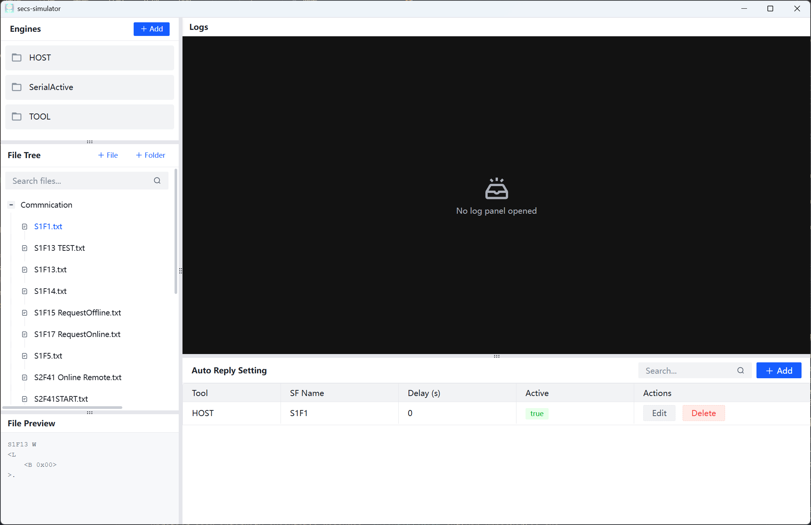
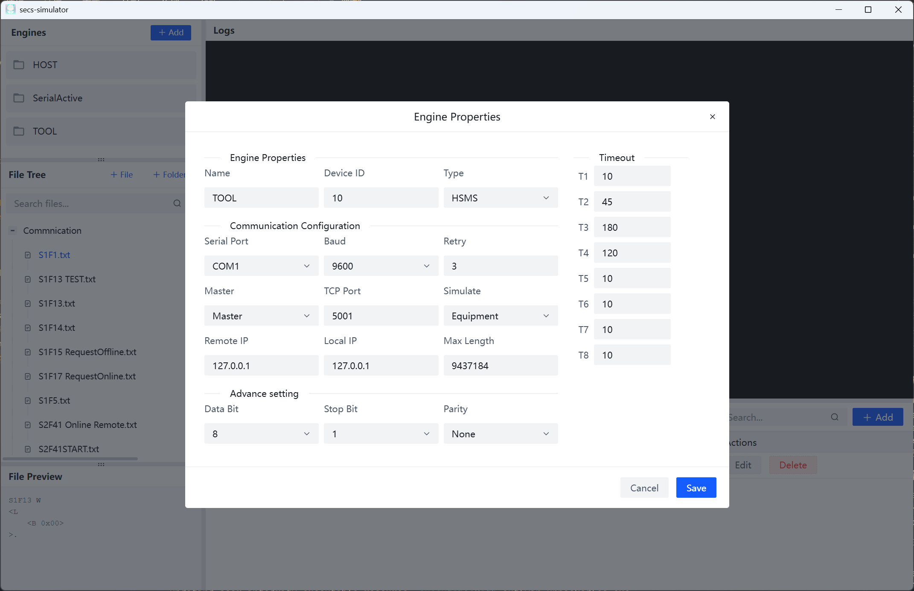
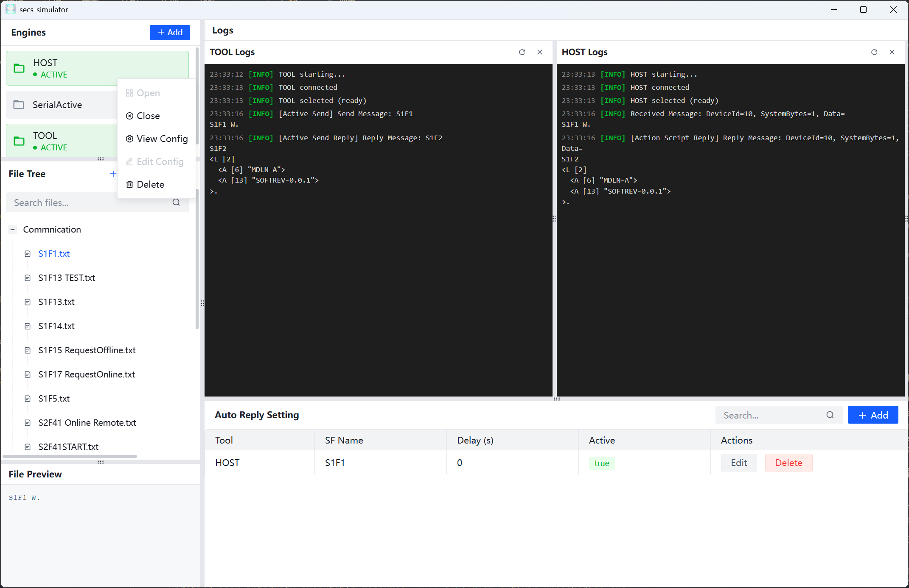
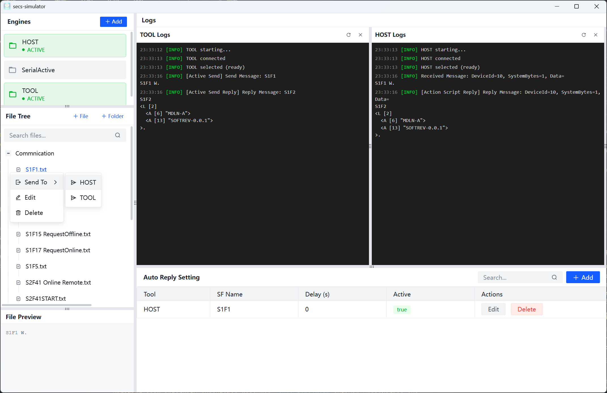
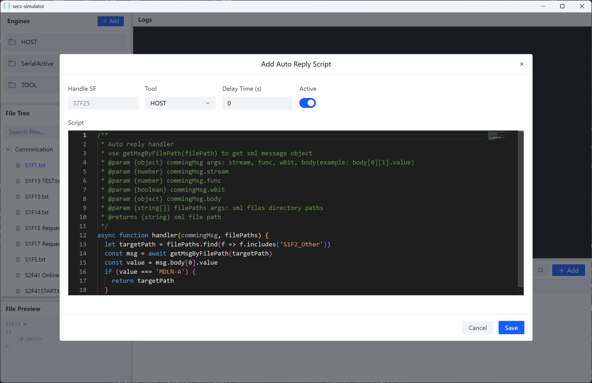
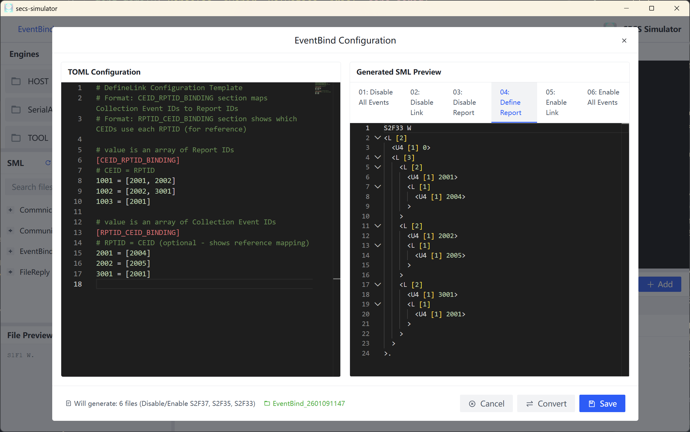

<div align=center>
<center><h1>secs-simulator<h1></center>
<div align=center>

</div>
<center><h3>特别感谢<h3></center>
</div>
<br>

<div align=center>

</div>

<div align=center>
<h3><strong>一个入门简单、跨平台、企业级桌面软件开发框架</strong></h3>
</div>
<br>

# 1. 简介

`secs-simulator` 是一款界面美观，使用简单，且在 auto-reply 自动回复上拥有极高灵活性的 SECS/GEM 测试与设备模拟工具。

基于 `electron-egg` 开发，`arco-design-vue` 作为 UI 组件库，`secs4js` 作为 SECS/GEM 通信库。

核心依赖：

- [`electron-egg`](https://github.com/dromara/electron-egg)：基于 `electron` 开发的桌面应用框架。
- [`arco-design-vue`](https://github.com/arco-design/arco-design-vue)：字节跳动出品的 Vue 组件库，提供了丰富的 UI 组件。
- [`secs4js`](https://github.com/LostCat-Qian/secs4js)：基于 TypeScript 的 SECS/GEM 通信库，用于实现 SECS/GEM 协议的通信。

<div align=center>

</div>

# 2. 核心功能

## 2.1 Engines

您可以通过 `Engines` 模块来创建和管理 SECS/GEM 引擎。每个引擎都可以配置为与不同的设备进行通信。

主要支持的功能：

- 支持创建多个 SECS/GEM 引擎实例。
- 每个引擎实例可以配置为与不同的设备进行通信。
- 支持配置引擎的连接参数，如 IP 地址、端口号等。
- 支持启动和停止引擎的通信。

## 2.2 SML File

您可以通过 `SML File` 模块来加载和解析 SECS/GEM 协议的 SML 文件。SML 文件是一种用于描述 SECS/GEM 协议的文本文件，通常用于定义设备的功能和通信参数。

主要支持的功能：

- 支持查看和编辑 SML 文件的内容。
- 支持根据 SML 文件生成对应的 SECS/GEM 协议代码。

## 2.3 LogPanel

您可以通过 `LogPanel` 模块来查看 SECS/GEM 引擎的通信日志。日志面板显示了引擎与设备之间的通信详情，包括发送的消息、接收的消息等。

主要支持的功能：

- 支持查看 SECS/GEM 引擎的通信日志。
- 自动保存日志到根目录下的 `secs-logs` 文件夹中。

## 2.4 AutoReply

您可以通过 `AutoReply` 模块来配置 SECS/GEM 引擎的自动回复。自动回复功能可以根据设备发送的消息，自动回复预定义的消息。

主要支持三种自动回复机制（按照优先级排序）：

1. 优先基于 AutoReply Scripts 的回复
2. 其次基于 SML File 中的回复规则，将自动查找文件名为 `S{stream}F{func + 1}` 的文件名，解析 SML 后自动回复。
3. 如果两种情况均未找到可触发回复的机制，则使用默认回复（S stream F func+1）

## 2.5 AutoReply Scripts

您可以通过 `AutoReply Scripts` 模块来配置 SECS/GEM 引擎的自动回复脚本。自动回复脚本是一种基于 JavaScript 的脚本，用于根据设备发送的消息，自动回复预定义的消息。

主要支持的功能：

- 支持查看和编辑 AutoReply Scripts 的内容。
- 支持根据 AutoReply Scripts 从 SML 文件解析对应的 SECS/GEM SML 代码。

# 3. How to Use

## 3.1 启动应用

您将看到应用主界面：

<div align=center>

</div>

## 3.2 配置 Engine

支持三种通信模式：

- HSMS-SS
- SECS-I
- SECS-I On TCP/IP

<div align=center>

</div>

## 3.3 打开 Engine

配置完成后，点击 `Open` 按钮，即可打开该引擎。

<div align=center>

</div>

## 3.4 发送消息

配置完成后，点击 `Send` 按钮，即可发送消息到设备。

<div align=center>

</div>

## 3.5 配置 AutoReply Scripts

AutoReply Scripts 是基于 JavaScript 编写的脚本，用于根据设备发送的消息，自动回复预定义的消息。

<div align=center>

</div>

默认方法名为 `handler(commingMsg, filePaths)`，参数含义如下：

1. `commingMsg`：表示设备发送到该引擎的消息，是一个 `SecsMessage` 对象。
2. `filePaths`：表示所有的本地 SML 文件的相对路径。

此外，工具本身提供了一个方法 `getMsgByFilePath(filePath: string)`，用于根据 SML 文件路径获取对应的 SECS/GEM 消息对象。该方法返回一个从 SML 文本中解析出的 `SecsMessage` 对象，您可以根据需要对其进行操作。

example:

```javascript
/**
 * Auto reply handler
 * use getMsgByFilePath(filePath) to get sml message object
 * @param {object} commingMsg args: stream, func, wBit, body(example: body[0][1].value)
 * @param {number} commingMsg.stream
 * @param {number} commingMsg.func
 * @param {boolean} commingMsg.wBit
 * @param {object} commingMsg.body
 * @param {string[]} filePaths args: sml files directory paths
 * @returns {string} sml file path
 */
async function handler(commingMsg, filePaths) {
  let targetPath = filePaths.find((f) => f.includes('S1F2_Other'))
  const msg = await getMsgByFilePath(targetPath)
  const value = msg.body[0].value
  if (value === 'MDLN-A') {
    return targetPath
  }
}
```

上面这段脚本的含义就是：从所有的 SML 文件中，查找文件名包含 `S1F2_Other` 的文件。如果该文件存在，且其 SML body 中的第一个元素值为 `MDLN-A`，则返回该文件的路径。否则，默认返回 `undefined`。

如果触发了这条规则，您就可以在对应的 LogPanel 中看到类似如下的日志：

```
23:33:16[INFO]Received Message: DeviceId=10, SystemBytes=1, Data=
S1F1 W.
23:33:16[INFO][Action Script Reply] Reply Message: DeviceId=10, SystemBytes=1, Data=
S1F2
<L [2]
  <A [6] "MDLN-A">
  <A [13] "SOFTREV-0.0.1">
>.
```

## 3.6 配置 Event Bind

根据 TOML 配置自动生成 Event Bind 指令。

配置好 TOML 内容后，点击 `Convert` 按钮即可完成 SML 指令转换，然后点击 `Save` 按钮即可保存到本地。

<div align=center>

</div>

example:

```toml
# DefineLink Configuration Template
# Format: CEID_RPTID_BINDING section maps Collection Event IDs to Report IDs
# Format: RPTID_CEID_BINDING section shows which CEIDs use each RPTID (for reference)

# value is an array of Report IDs
[CEID_RPTID_BINDING]
# CEID = RPTID
1001 = [2001, 2002]
1002 = [2002, 3001]
1003 = [2001]

# value is an array of Collection Event IDs
[RPTID_CEID_BINDING]
# RPTID = CEID (optional - shows reference mapping)
2001 = [2004]
2002 = [2005]
3001 = [2001]
```